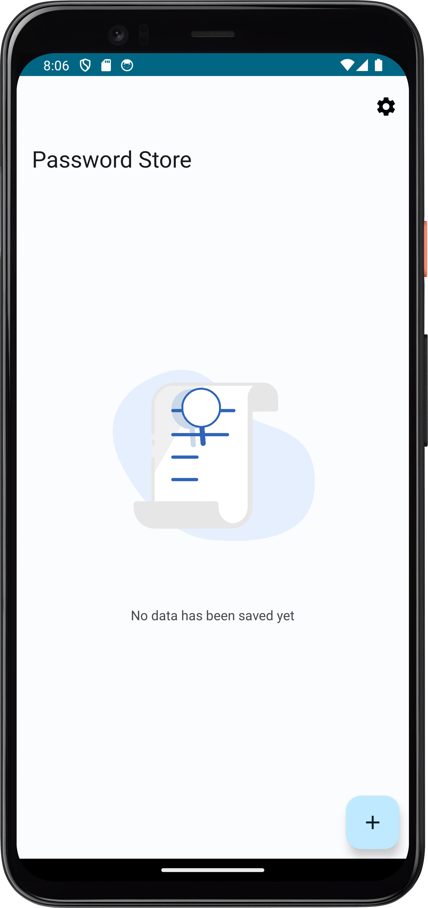
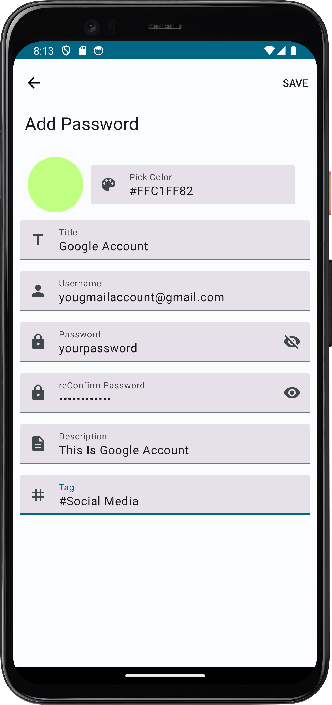
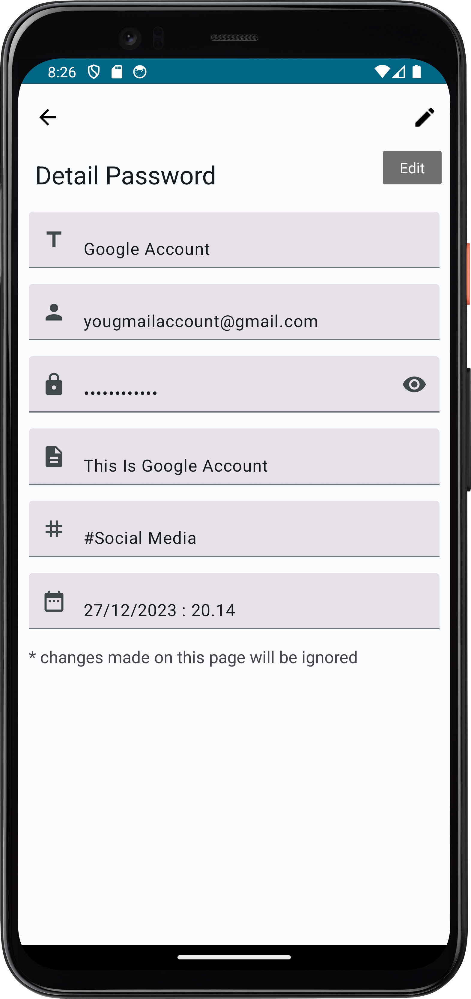
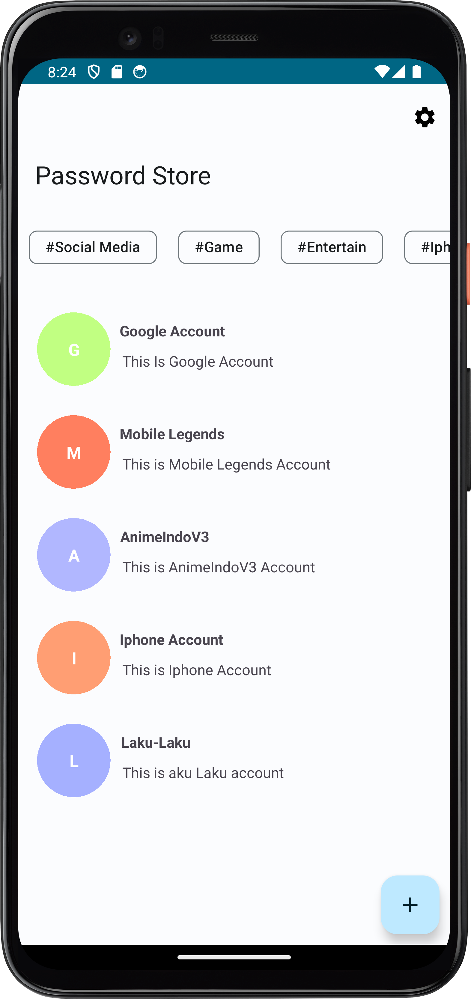
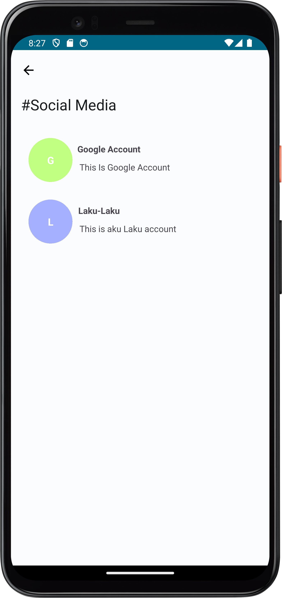
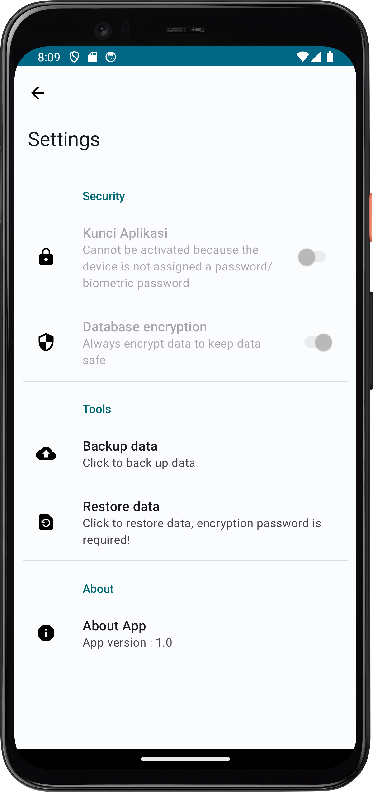
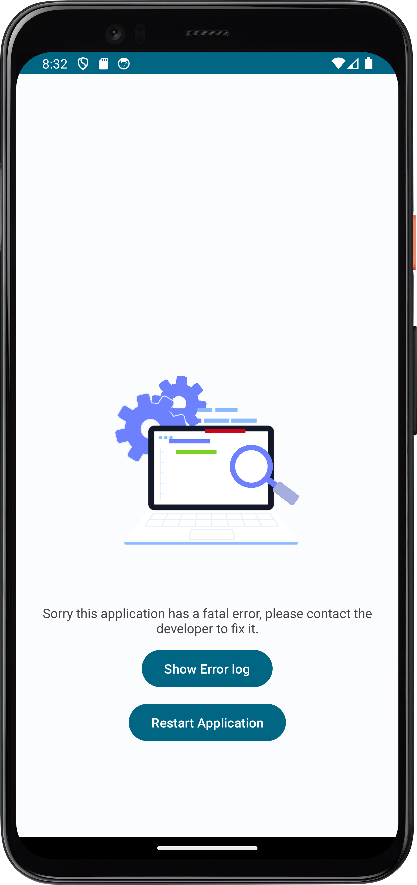
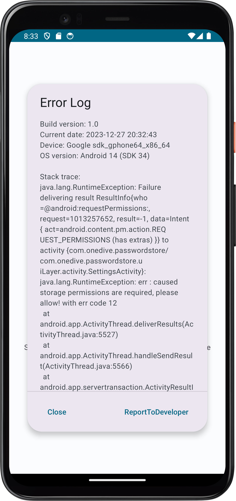

# Password Store
## _The Best Application of Password Store_


## Features

- Create,Read,Update,And Delete Data
- Encrypted Data
- Backup and Restore Data
- Application performance is good and fast
- Easy to understand interface

## Tech

Password Store uses a number of open source projects to work properly:

- [Kotlin] -This project uses Kotlin language around 85%
- [Java] - This project uses Java language around 15%
- [Kotlin coroutine] - This project uses Kotlin coroutines so it will not interfere with the UI thread in displaying large amounts of data
- [ViewModel Architecture] - This project uses an architectural View Model, one of the advantages of which is that data will not be lost if there is a change in screen orientation
- [AndroidFramework] - Standard SDK

## App Screenshots

- No Items Founds


- Add Data


- Detail Data


- List Data


- List Data By Tag


- Settings Screen


- Error Screen


- Show Log Screen


## License

MIT Licence

``` xml
Copyright (c) 2024 Ridho Ardhiansyah

Permission is hereby granted, free of charge, to any person obtaining a copy
of this software and associated documentation files (the "Software"), to deal
in the Software without restriction, including without limitation the rights
to use, copy, modify, merge, publish, distribute, sublicense, and/or sell
copies of the Software, and to permit persons to whom the Software is
furnished to do so, subject to the following conditions:

The above copyright notice and this permission notice shall be included in all
copies or substantial portions of the Software.

THE SOFTWARE IS PROVIDED "AS IS", WITHOUT WARRANTY OF ANY KIND, EXPRESS OR
IMPLIED, INCLUDING BUT NOT LIMITED TO THE WARRANTIES OF MERCHANTABILITY,
FITNESS FOR A PARTICULAR PURPOSE AND NONINFRINGEMENT. IN NO EVENT SHALL THE
AUTHORS OR COPYRIGHT HOLDERS BE LIABLE FOR ANY CLAIM, DAMAGES OR OTHER
LIABILITY, WHETHER IN AN ACTION OF CONTRACT, TORT OR OTHERWISE, ARISING FROM,
OUT OF OR IN CONNECTION WITH THE SOFTWARE OR THE USE OR OTHER DEALINGS IN THE
SOFTWARE.
```